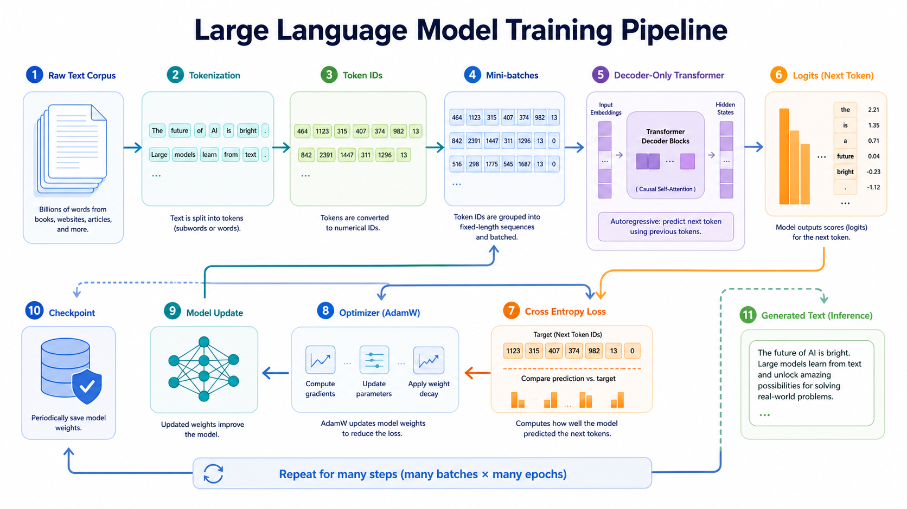
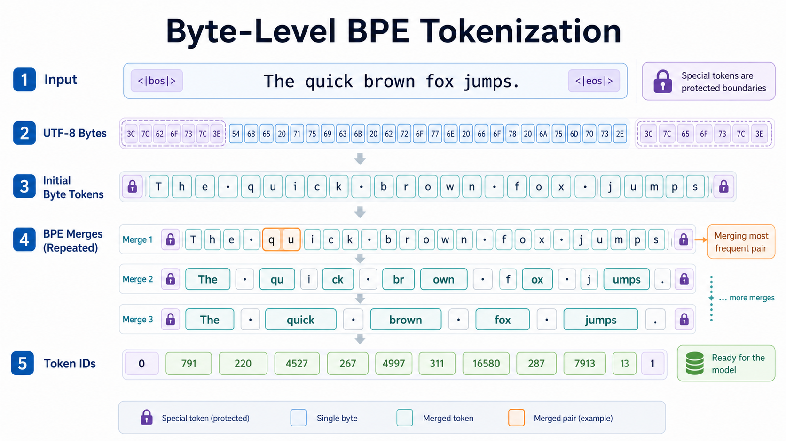
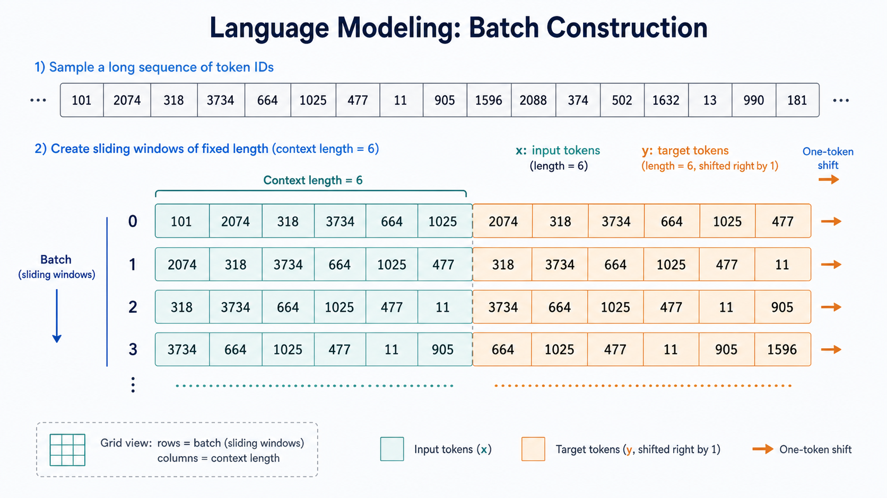
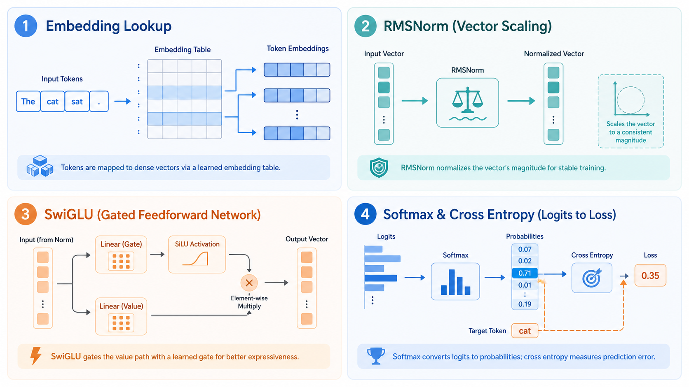
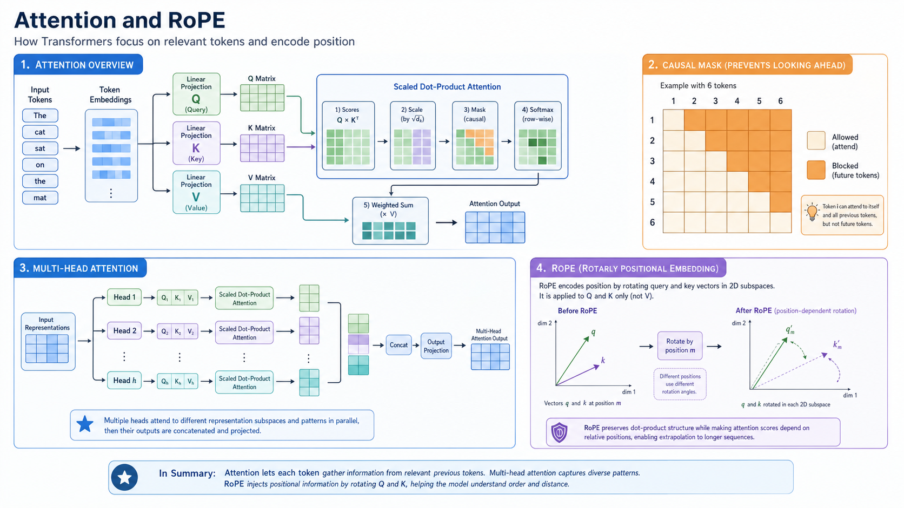
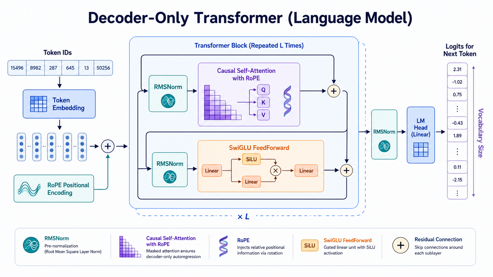
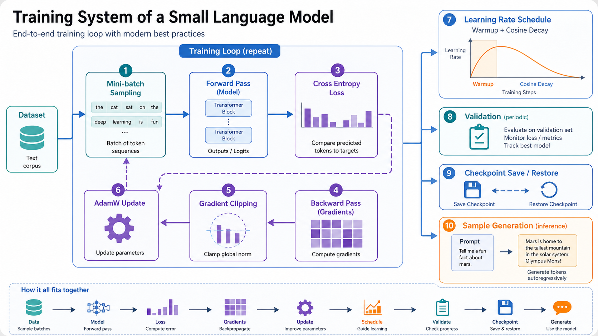

# 🎯 CS336 作业一学习文档：从文本到可训练的 GPT

CS336 Assignment 1 的核心价值，是把一个 decoder-only Transformer 语言模型拆成一组可以逐个验证的工程模块：tokenizer、batch sampler、Transformer block、loss、optimizer、checkpoint 和实验记录。学完这份作业，读者不只是知道 GPT 的结构名词，而是能把原始文本一步步送进模型，并让参数真的被梯度更新。

在 LLM 训练领域，最重要的主线是 **next-token prediction**：给定前面的 token，预测下一个 token。这个目标看似单一，却能把语法、语义、事实关联、长程依赖和生成能力都压缩进同一套训练流程里。

本文按照数据流组织，而不是按照文件名组织：

**文本 -> tokenizer -> batch -> Transformer -> logits -> loss -> optimizer -> checkpoint -> experiment**

| 章节 | 核心问题 | 对应测试 |
|------|---------|----------|
| 0. 🌍 LLM 全景 | 为什么预测下一个 token 能训练语言模型 | 贯穿全部测试 |
| 1. 🔤 Tokenizer | 文本如何变成 token id | `test_train_bpe.py`, `test_tokenizer.py` |
| 2. 📦 Batch | 输入和标签为什么右移一位 | `test_data.py` |
| 3. 🧱 基础层 | Transformer 的最小神经网络积木是什么 | `test_model.py`, `test_nn_utils.py` |
| 4. 🧲 Attention 与 RoPE | 模型如何读取上下文并保持因果性 | `test_model.py` |
| 5. 🏗️ Decoder-only LM | 如何组装完整 GPT 风格模型 | `test_model.py` |
| 6. ⚙️ 训练系统 | loss、AdamW、学习率、梯度裁剪如何协作 | `test_optimizer.py`, `test_serialization.py` |
| 7. 📈 实验复盘 | 如何判断训练是否有效 | writeup 与实验日志 |

---

## 🌍 0. 大语言模型全景



> 💡 **如何读这张图**：左侧是原始文本语料，中间经过 tokenizer 变成 token id，再组成 batch 输入 Transformer。模型输出 logits，loss 衡量预测和真实下一个 token 的差距，optimizer 根据梯度更新参数。checkpoint 和生成样例是训练过程的观测窗口。

### 0.1 什么是大语言模型

在 LLM 训练领域，**大语言模型**被定义为一种基于上下文预测 token 概率分布的神经网络。它不是直接存储句子答案，而是学习一个条件概率模型：

$$
P(x_t \mid x_1, x_2, \dots, x_{t-1})
$$

要理解这个定义，需要拆成 4 个要素。首先是 **token**，它是模型实际处理的离散单位，可能是 byte、词片段、标点或 special token。其次是 **context**，它是当前位置之前的 token 序列。第三是 **概率分布**，模型不是只输出一个答案，而是对整个词表给出 logits。最后是 **参数学习**，loss 会把错误预测转成梯度，梯度再更新模型参数。

以 TinyStories 训练为例，模型看到：

```text
Once upon a
```

它需要让 `time`、`little`、`small` 等合理 token 的概率高于无关 token。训练语料足够大时，next-token prediction 会迫使模型学习角色、事件顺序、句法结构和常见叙事模式。

### 0.2 数学公式

一整段 token 序列的概率可以分解为条件概率乘积：

$$
P(x_1, x_2, \dots, x_T)
=
\prod_{t=1}^{T}
P(x_t \mid x_1, x_2, \dots, x_{t-1})
$$

其中：
- $x_t$ — 第 $t$ 个 token，典型取值是一个整数 token id；
- $T$ — 序列长度，作业中常由 `context_length` 控制；
- $P(x_t \mid x_{<t})$ — 给定历史上下文后，当前位置真实 token 的概率。

> 📖 **直观理解**：语言模型把“整段文本好不好”拆成很多个“下一个 token 猜得准不准”。

### 0.3 完整可运行代码：next-token 训练目标

下面的代码不依赖项目文件，只演示 next-token prediction 如何从 token id 序列构造输入和标签。

```python
import torch


def build_next_token_example(tokens: list[int], context_length: int) -> tuple[torch.Tensor, torch.Tensor]:
    """从一段 token id 中构造一个 next-token prediction 样本。

    参数:
        tokens: 原始 token id 序列。
        context_length: 输入序列长度。

    返回:
        x: shape 为 (context_length,) 的输入 token。
        y: shape 为 (context_length,) 的目标 token，整体比 x 右移一位。
    """
    token_tensor = torch.tensor(tokens, dtype=torch.long)
    x = token_tensor[:context_length]
    y = token_tensor[1 : context_length + 1]
    return x, y


x, y = build_next_token_example([101, 42, 77, 88, 5], context_length=4)
print("x =", x.tolist())
print("y =", y.tolist())
print("每个位置的训练对 =", list(zip(x.tolist(), y.tolist())))
```

运行输出：

```text
x = [101, 42, 77, 88]
y = [42, 77, 88, 5]
每个位置的训练对 = [(101, 42), (42, 77), (77, 88), (88, 5)]
```

### 0.4 常见理解误区

学习 next-token prediction 时，容易把它理解成一个过于简单的分类任务。更准确的看法是：它是一个把文本语料转成密集监督信号的训练协议，每个 token 位置都会产生一次预测、一次 loss 和一次梯度贡献。下面几个误区会直接影响后续对 tokenizer、batch 和 loss 的理解。

**① 目标简单但计算量巨大。** 每个位置都要对整个词表输出 logits，词表大小常见为几万到十几万。即使单个样本的目标只是一个 token，模型也需要学习完整概率分布。在长上下文、大 batch、多层 Transformer 下，显存和算力压力会迅速放大。

**② 模型只能从 token 序列中学习。** 如果 tokenizer 把文本切得很差，后面的 Transformer 再强也会被输入表示拖累。比如 special token 被拆开，训练样本边界会混乱；UTF-8 bytes 处理错误，decode 会出现替换字符。这个问题在多语言语料和代码语料里尤其明显。

**③ 训练目标不直接等于高质量生成。** loss 下降说明模型更会预测语料中的 token，但生成质量还受采样策略、prompt、数据分布和模型规模影响。小模型在 TinyStories 上 loss 很低，也可能在开放域问题上表现很弱。

> 🔗 **承上启下**：既然模型只接收 token id，下一节的 tokenizer 就是整条链路的入口。文本切分、byte 表示、BPE merge 和 special token 边界，决定了后续 batch 与 Transformer 能看到什么信息。

---

## 🔤 1. 文本与 Tokenizer



> 💡 **如何读这张图**：文本先编码成 UTF-8 bytes，再被 GPT-2 风格正则切成 pre-token。BPE 训练会反复合并高频相邻 pair，得到 vocab 和 merges。special token 是硬边界，不能和普通文本跨边界合并。

### 1.1 什么是 byte-level BPE tokenizer

在 LLM 训练领域，**byte-level BPE tokenizer** 被定义为一种先把文本转成 UTF-8 bytes，再通过 Byte Pair Encoding 学习高频 byte 片段的分词方法。

要理解它，需要拆成 4 个要素。首先是 **UTF-8 bytes**，它保证任意 Unicode 文本都可表示。其次是 **pre-tokenization**，它用正则给 BPE 设定局部边界。第三是 **BPE merge**，它通过高频 pair 合并压缩序列长度。最后是 **vocab 与 merges**，前者定义 token id 到 bytes 的映射，后者定义 encode 时的合并优先级。

以 OpenWebText 训练为例，语料里同时有英文、数字、URL、标点和换行。byte-level BPE 不需要为每种 Unicode 字符预先建表，只要从 256 个 byte 出发，就能覆盖全部文本。

### 1.2 Unicode、UTF-8 与 bytes

文本 `"世界"` 在 Python 中是 Unicode 字符串，但 tokenizer 训练时通常先转成 UTF-8 bytes：

```python
text = "世界"
print("字符数量:", len(text))
print("UTF-8 bytes:", text.encode("utf-8"))
print("byte 整数:", list(text.encode("utf-8")))
```

运行输出：

```text
字符数量: 2
UTF-8 bytes: b'\xe4\xb8\x96\xe7\x95\x8c'
byte 整数: [228, 184, 150, 231, 149, 140]
```

> 📖 **直观理解**：模型最终看到的是整数 id；byte-level tokenizer 的第一层整数来自 UTF-8 bytes。

### 1.3 GPT-2 风格 pre-tokenization

作业中使用的正则是：

```python
PAT = r"""'(?:[sdmt]|ll|ve|re)| ?\p{L}+| ?\p{N}+| ?[^\s\p{L}\p{N}]+|\s+(?!\S)|\s+"""
```

它需要 `regex` 包支持 `\p{L}` 和 `\p{N}`：

```python
import regex as re


def gpt2_pretokenize(text: str) -> list[str]:
    """使用 GPT-2 风格正则切分文本。

    参数:
        text: 输入字符串。

    返回:
        pre-token 字符串列表。
    """
    pattern = r"""'(?:[sdmt]|ll|ve|re)| ?\p{L}+| ?\p{N}+| ?[^\s\p{L}\p{N}]+|\s+(?!\S)|\s+"""
    return re.findall(pattern, text)


pieces = gpt2_pretokenize("Hello, CS336! It's 2026.\n")
print(pieces)
```

运行输出：

```text
['Hello', ',', ' CS', '336', '!', ' It', "'s", ' 2026', '.', '\n']
```

### 1.4 BPE 训练公式与流程

BPE 每一步选择最高频相邻 pair：

$$
(a^\*, b^\*)
=
\arg\max_{(a,b)}
\operatorname{count}(a,b)
$$

其中：
- $(a,b)$ — 一个相邻 token pair，初始 token 是单 byte；
- $\operatorname{count}(a,b)$ — 该 pair 在所有 pre-token 中出现的加权次数；
- $(a^\*, b^\*)$ — 本轮要合并的 pair。

> 📖 **直观理解**：BPE 每轮都把当前语料里最常一起出现的相邻片段粘成一个更大的 token。

作业还要求同频时按 pair 字典序打破平局：

```python
best_pair = max(pair_counts, key=lambda pair: (pair_counts[pair], pair))
```

### 1.5 完整可运行代码：小型 BPE 训练

下面代码实现一个最小 byte-level BPE 训练器。它只用于学习机制，真实作业还要处理 special token、大文件性能和测试细节。

```python
from collections import Counter, defaultdict
import regex as re

PAT = r"""'(?:[sdmt]|ll|ve|re)| ?\p{L}+| ?\p{N}+| ?[^\s\p{L}\p{N}]+|\s+(?!\S)|\s+"""


def pretoken_counts(text: str) -> Counter:
    """把文本切成 pre-token，并统计每个 byte tuple 的频次。

    参数:
        text: 输入训练文本。

    返回:
        key 为 byte token tuple，value 为频次的 Counter。
    """
    counts: Counter = Counter()
    for piece in re.findall(PAT, text):
        byte_tuple = tuple(bytes([b]) for b in piece.encode("utf-8"))
        counts[byte_tuple] += 1
    return counts


def count_pairs(word_counts: Counter) -> dict[tuple[bytes, bytes], int]:
    """统计所有相邻 pair 的加权频次。"""
    pair_counts: defaultdict[tuple[bytes, bytes], int] = defaultdict(int)
    for word, count in word_counts.items():
        for left, right in zip(word, word[1:]):
            pair_counts[(left, right)] += count
    return dict(pair_counts)


def merge_word(word: tuple[bytes], pair: tuple[bytes, bytes]) -> tuple[bytes]:
    """在单个 word 内合并指定 pair。"""
    merged: list[bytes] = []
    i = 0
    while i < len(word):
        if i + 1 < len(word) and word[i] == pair[0] and word[i + 1] == pair[1]:
            merged.append(pair[0] + pair[1])
            i += 2
        else:
            merged.append(word[i])
            i += 1
    return tuple(merged)


def train_tiny_bpe(text: str, num_merges: int) -> list[tuple[bytes, bytes]]:
    """训练一个小型 BPE merge 列表。

    参数:
        text: 训练语料。
        num_merges: 合并轮数。

    返回:
        按创建顺序排列的 merge pair。
    """
    word_counts = pretoken_counts(text)
    merges: list[tuple[bytes, bytes]] = []

    for _ in range(num_merges):
        pair_counts = count_pairs(word_counts)
        if len(pair_counts) == 0:
            break
        best_pair = max(pair_counts, key=lambda pair: (pair_counts[pair], pair))
        merges.append(best_pair)

        next_counts: Counter = Counter()
        for word, count in word_counts.items():
            next_counts[merge_word(word, best_pair)] += count
        word_counts = next_counts

    return merges


merges = train_tiny_bpe("low lower lowest low", num_merges=5)
for index, pair in enumerate(merges):
    print(index, pair, "->", pair[0] + pair[1])
```

运行输出：

```text
0 (b'l', b'o') -> b'lo'
1 (b'lo', b'w') -> b'low'
2 (b' low', b'e') -> b' lowe'
3 (b' lowe', b'r') -> b' lower'
4 (b' lowe', b's') -> b' lowes'
```

### 1.6 完整可运行代码：encode 与 decode

```python
def apply_bpe_to_bytes(data: bytes, merges: list[tuple[bytes, bytes]]) -> list[bytes]:
    """按照 merge rank 对 byte 序列执行 BPE 编码。

    参数:
        data: 一个 pre-token 的 UTF-8 bytes。
        merges: 训练得到的 merge pair，顺序越靠前优先级越高。

    返回:
        BPE token bytes 列表。
    """
    tokens = [bytes([b]) for b in data]
    merge_rank = {pair: rank for rank, pair in enumerate(merges)}

    while True:
        best_index = -1
        best_rank = len(merge_rank) + 1
        for index, pair in enumerate(zip(tokens, tokens[1:])):
            rank = merge_rank.get(pair)
            if rank is not None and rank < best_rank:
                best_index = index
                best_rank = rank
        if best_index < 0:
            return tokens
        tokens = (
            tokens[:best_index]
            + [tokens[best_index] + tokens[best_index + 1]]
            + tokens[best_index + 2 :]
        )


vocab = {0: b'l', 1: b'o', 2: b'w', 3: b'lo', 4: b'low'}
token_to_id = {value: key for key, value in vocab.items()}
merges = [(b'l', b'o'), (b'lo', b'w')]

pieces = apply_bpe_to_bytes(b"low", merges)
ids = [token_to_id[piece] for piece in pieces]
decoded = b"".join(vocab[token_id] for token_id in ids).decode("utf-8")
print("BPE pieces:", pieces)
print("token ids:", ids)
print("decoded:", decoded)
```

运行输出：

```text
BPE pieces: [b'low']
token ids: [4]
decoded: low
```

### 1.7 常见坑与下一步

byte-level BPE 的思路很清楚，但实现时容易在边界、效率和多语言处理上踩坑。这些问题不只是 tokenizer 局部错误，还会污染后续 batch 和模型训练。

**① 训练速度容易被 pair 统计拖慢。** 朴素实现每轮都重新扫描所有 pre-token，语料变大后会非常慢。OpenWebText 级别文本会让 CPU 时间和内存占用迅速增长。作业测试里有 `test_train_bpe_speed`，就是为了暴露低效实现。

**② special token 处理不当会破坏样本边界。** 如果 `<|endoftext|>` 被拆开或参与普通 pair 合并，文档分隔符就不再可靠。训练时模型可能把跨文档内容当作连续上下文，影响语言建模目标。

**③ byte 粒度对多语言文本不总是高效。** 中文、日文、emoji 等字符会占多个 UTF-8 bytes，初始序列比英文更长。BPE 可以通过 merge 缓解这个问题，但小 vocab 或小语料下仍可能产生较碎的 token。

> 🔗 **承上启下**：tokenizer 输出的是一维 token id 序列。下一节的 batch sampler 会把这条长序列切成固定长度窗口，并构造 next-token prediction 的 `x/y` 标签。

---

## 📦 2. 数据进入模型：Batch 构造



> 💡 **如何读这张图**：长条是一整段 token id 序列。训练时随机截取多个长度为 `context_length` 的窗口组成 batch。每个窗口的 `x` 是当前位置序列，`y` 是整体右移一位后的目标序列。

### 2.1 什么是 language modeling batch

在语言模型训练领域，**batch** 被定义为一组固定长度的 token 窗口。每个窗口包含输入 `x` 和目标 `y`，其中 `y` 比 `x` 向右错开一个 token。

要理解 batch，需要拆成 3 个要素。首先是 **dataset**，它是一条很长的一维 token id 数组。其次是 **context_length**，它决定每个样本最多看多少历史 token。最后是 **batch_size**，它决定一次前向传播并行处理多少个窗口。

以 TinyStories 为例，整份训练集会先被 tokenizer 编成一个很长的 `np.ndarray`。训练循环每一步只随机抽取其中一小部分窗口，这样既能打乱样本，又能控制显存。

### 2.2 右移一位的数学含义

给定 token 序列：

$$
s = [s_0, s_1, s_2, \dots, s_n]
$$

从起点 $i$ 截取长度为 $L$ 的输入：

$$
x = [s_i, s_{i+1}, \dots, s_{i+L-1}]
$$

目标为：

$$
y = [s_{i+1}, s_{i+2}, \dots, s_{i+L}]
$$

其中：
- $s_i$ — 原始 token 序列中的第 $i$ 个 token；
- $L$ — `context_length`；
- $x_t$ — 第 $t$ 个输入位置；
- $y_t$ — 第 $t$ 个位置要预测的下一个 token。

> 📖 **直观理解**：同一个窗口里，每个位置都变成一个监督样本，因此长度为 $L$ 的序列能贡献 $L$ 个预测目标。

### 2.3 完整可运行代码：get_batch

```python
import numpy as np
import torch


def get_batch(
    dataset: np.ndarray,
    batch_size: int,
    context_length: int,
    device: str,
    seed: int,
) -> tuple[torch.Tensor, torch.Tensor]:
    """从一维 token id 数组中采样语言模型训练 batch。

    参数:
        dataset: shape 为 (num_tokens,) 的 token id 数组。
        batch_size: batch 中样本数量。
        context_length: 每个样本的输入长度。
        device: 输出张量所在设备。
        seed: 随机种子，便于示例复现。

    返回:
        x: shape 为 (batch_size, context_length) 的输入 token。
        y: shape 为 (batch_size, context_length) 的目标 token。
    """
    generator = torch.Generator().manual_seed(seed)
    max_start = len(dataset) - context_length
    starts = torch.randint(0, max_start, (batch_size,), generator=generator)

    x_rows = []
    y_rows = []
    for start in starts.tolist():
        x_rows.append(torch.as_tensor(dataset[start : start + context_length], dtype=torch.long))
        y_rows.append(torch.as_tensor(dataset[start + 1 : start + context_length + 1], dtype=torch.long))

    x = torch.stack(x_rows).to(device)
    y = torch.stack(y_rows).to(device)
    return x, y


tokens = np.arange(20, dtype=np.int64)
x, y = get_batch(tokens, batch_size=2, context_length=5, device="cpu", seed=0)
print("x =")
print(x)
print("y =")
print(y)
print("y - x =")
print(y - x)
```

运行输出：

```text
x =
tensor([[14, 15, 16, 17, 18],
        [ 9, 10, 11, 12, 13]])
y =
tensor([[15, 16, 17, 18, 19],
        [10, 11, 12, 13, 14]])
y - x =
tensor([[1, 1, 1, 1, 1],
        [1, 1, 1, 1, 1]])
```

### 2.4 常见坑与下一步

Batch 构造看起来只是数组切片，但它决定了模型每一步到底在学什么。只要 `x/y` 错位、起点范围或文档边界处理有问题，训练 loss 的解释就会失真。

**① 起点范围容易 off-by-one。** 如果最大起点写成 `len(dataset) - context_length + 1`，`y` 会访问越界。这个错误在小数组测试中很明显，在大数据训练中可能偶发崩溃。

**② 窗口会切断长文档结构。** 随机采样只保证局部上下文连续，不保证完整文档边界。对于 OpenWebText 这类多文档语料，如果不处理 `<|endoftext|>`，模型可能学习到跨文档的虚假连接。

**③ batch 随机性会影响实验复现。** 学习率 sweep 或消融实验如果不记录 seed，同一个配置的 loss 曲线可能有明显波动。小模型、小步数实验尤其容易受采样噪声影响。

> 🔗 **承上启下**：batch 的输出 `x` 是整数 token id。下一节的 Embedding 会把这些整数查成连续向量，Linear、RMSNorm、SwiGLU、softmax 和 cross entropy 则构成 Transformer 的基础计算单元。

---

## 🧱 3. Transformer 基础层



> 💡 **如何读这张图**：Embedding 把 token id 查成向量，RMSNorm 稳定隐藏状态尺度，SwiGLU 提供非线性前馈变换，softmax 与 cross entropy 把 logits 变成训练损失。

### 3.1 Linear：无 bias 矩阵投影

在神经网络领域，**Linear 层**被定义为对输入向量执行可学习矩阵投影的层。CS336 作业中要求不使用 bias，因此核心计算只有矩阵乘法。

要理解 Linear，需要拆成 3 个要素。首先是 **输入维度** `d_in`，它对应上一层隐藏状态的最后一维。其次是 **输出维度** `d_out`，它决定投影后的特征数。最后是 **权重矩阵**，作业约定形状为 `(d_out, d_in)`。

以 Transformer 中的 Q/K/V projection 为例，输入 hidden state 形状是 `(batch, seq, d_model)`，三个 Linear 层分别把它投影成 query、key、value。

$$
y = xW^\top
$$

其中：
- $x$ — 输入张量，最后一维为 `d_in`；
- $W$ — 权重矩阵，形状为 `(d_out, d_in)`；
- $y$ — 输出张量，最后一维为 `d_out`。

> 📖 **直观理解**：Linear 改变的是每个 token 向量的特征坐标，不改变 batch 和 sequence 维度。

```python
import torch


def run_linear(x: torch.Tensor, weight: torch.Tensor) -> torch.Tensor:
    """执行无 bias Linear 投影。

    参数:
        x: 最后一维为 d_in 的输入张量，可带任意数量的前缀维度。
        weight: shape 为 (d_out, d_in) 的权重矩阵。

    返回:
        最后一维为 d_out 的输出张量，前缀维度与 x 保持一致。
    """
    return x @ weight.T


x = torch.tensor([[1.0, 2.0, 3.0]])
weight = torch.tensor([[1.0, 0.0, 0.0], [0.0, 1.0, 1.0]])
print(run_linear(x, weight))
```

运行输出：

```text
tensor([[1., 5.]])
```

### 3.2 Embedding：token id 查表

在语言模型领域，**Embedding 层**被定义为一个可学习查表矩阵，把离散 token id 映射为连续向量。

要理解 Embedding，需要拆成 3 个要素。首先是 **词表大小** `vocab_size`，它决定有多少行。其次是 **向量维度** `d_model`，它决定每个 token 的表示长度。最后是 **索引操作**，输入 token id 直接选取矩阵中的对应行。

```python
import torch


def run_embedding(token_ids: torch.Tensor, weight: torch.Tensor) -> torch.Tensor:
    """根据 token id 查 embedding。

    参数:
        token_ids: 任意形状的整数张量。
        weight: shape 为 (vocab_size, d_model) 的 embedding 矩阵。

    返回:
        最后一维为 d_model 的 embedding 张量，前缀维度来自 token_ids。
    """
    return weight[token_ids]


embedding_weight = torch.tensor([
    [0.0, 0.0],
    [1.0, 0.5],
    [0.2, 2.0],
])
token_ids = torch.tensor([[1, 2, 1]])
print(run_embedding(token_ids, embedding_weight))
```

运行输出：

```text
tensor([[[1.0000, 0.5000],
         [0.2000, 2.0000],
         [1.0000, 0.5000]]])
```

### 3.3 RMSNorm：稳定隐藏状态尺度

在 Transformer 训练领域，**RMSNorm** 被定义为一种只按均方根缩放、不减均值的归一化方法。

$$
\operatorname{RMSNorm}(x)
=
\frac{x}{\sqrt{\frac{1}{d}\sum_{i=1}^{d}x_i^2 + \epsilon}}
\odot g
$$

其中：
- $x$ — 一个 token 的 hidden vector；
- $d$ — hidden dimension，典型值如 512、768、4096；
- $\epsilon$ — 数值稳定项，常见值 `1e-5`；
- $g$ — 可学习缩放向量，形状为 `(d,)`。

> 📖 **直观理解**：RMSNorm 控制向量整体幅度，避免层数加深后 hidden state 尺度失控。

```python
import torch


def rmsnorm(x: torch.Tensor, weight: torch.Tensor, eps: float = 1e-5) -> torch.Tensor:
    """执行 RMSNorm。

    参数:
        x: 最后一维为 d_model 的输入张量。
        weight: shape 为 (d_model,) 的可学习缩放参数。
        eps: 数值稳定项。

    返回:
        shape 与 x 相同的归一化结果。
    """
    rms = torch.sqrt(torch.mean(x.float() * x.float(), dim=-1, keepdim=True) + eps)
    return (x.float() / rms * weight).to(dtype=x.dtype)


x = torch.tensor([[3.0, 4.0]])
weight = torch.tensor([1.0, 1.0])
print(rmsnorm(x, weight))
```

运行输出：

```text
tensor([[0.8485, 1.1314]])
```

### 3.4 SwiGLU：门控前馈网络

在现代 Transformer 中，**SwiGLU** 被定义为一种带门控分支的前馈网络。它比普通两层 MLP 多一个门控投影，可以更灵活地控制哪些特征通过。

$$
\operatorname{SwiGLU}(x)
=
W_2
\left(
\operatorname{SiLU}(W_1x)
\odot
W_3x
\right)
$$

其中：
- $W_1$ — gate 分支投影，`d_model -> d_ff`；
- $W_3$ — value 分支投影，`d_model -> d_ff`；
- $W_2$ — 输出投影，`d_ff -> d_model`；
- $\operatorname{SiLU}(u)=u\sigma(u)$。

> 📖 **直观理解**：SwiGLU 让一条分支决定“开多大门”，另一条分支提供“要通过的内容”。

```python
import torch


def silu(x: torch.Tensor) -> torch.Tensor:
    """计算 SiLU 激活。"""
    return x * torch.sigmoid(x)


def swiglu(x: torch.Tensor, w1: torch.Tensor, w2: torch.Tensor, w3: torch.Tensor) -> torch.Tensor:
    """执行 SwiGLU 前馈网络。

    参数:
        x: 最后一维为 d_model 的输入。
        w1: shape 为 (d_ff, d_model) 的 gate 权重。
        w2: shape 为 (d_model, d_ff) 的输出权重。
        w3: shape 为 (d_ff, d_model) 的 value 权重。

    返回:
        最后一维为 d_model 的输出，前缀维度与 x 保持一致。
    """
    hidden = silu(x @ w1.T) * (x @ w3.T)
    return hidden @ w2.T


x = torch.tensor([[1.0, 2.0]])
w1 = torch.tensor([[1.0, 0.0], [0.0, 1.0]])
w3 = torch.tensor([[0.5, 0.0], [0.0, 0.5]])
w2 = torch.tensor([[1.0, 1.0], [1.0, -1.0]])
print(torch.round(swiglu(x, w1, w2, w3), decimals=4))
```

运行输出：

```text
tensor([[ 2.4927, -1.7311]])
```

### 3.5 Softmax 与 Cross Entropy

在分类训练领域，**softmax** 把 logits 转成概率分布，**cross entropy** 衡量模型给真实类别的概率有多高。

$$
\operatorname{softmax}(z_i)
=
\frac{\exp(z_i - m)}
{\sum_j \exp(z_j - m)}
,\quad
m=\max_j z_j
$$

$$
\mathcal{L}
=
\frac{1}{B}
\sum_{i=1}^{B}
\left(
\log\sum_j\exp(z_{i,j})
- z_{i,y_i}
\right)
$$

其中：
- $z_{i,j}$ — 第 $i$ 个样本第 $j$ 个词表项的 logit；
- $y_i$ — 第 $i$ 个样本的真实 token id；
- $B$ — 样本数，训练 LM 时常等于 `batch_size * context_length`。

```python
import torch


def stable_softmax(logits: torch.Tensor, dim: int) -> torch.Tensor:
    """数值稳定 softmax。"""
    shifted = logits - torch.max(logits, dim=dim, keepdim=True).values
    exp = torch.exp(shifted)
    return exp / torch.sum(exp, dim=dim, keepdim=True)


def cross_entropy(logits: torch.Tensor, targets: torch.Tensor) -> torch.Tensor:
    """计算平均 cross entropy。

    参数:
        logits: shape 为 (batch, vocab_size) 的未归一化分数。
        targets: shape 为 (batch,) 的真实类别 id。

    返回:
        标量 loss。
    """
    max_logits = torch.max(logits, dim=-1, keepdim=True).values
    shifted = logits - max_logits
    logsumexp = torch.log(torch.sum(torch.exp(shifted), dim=-1)) + max_logits.squeeze(-1)
    gold_logits = logits[torch.arange(logits.shape[0]), targets]
    return torch.mean(logsumexp - gold_logits)


logits = torch.tensor([[2.0, 1.0, 0.0], [0.0, 3.0, 1.0]])
targets = torch.tensor([0, 2])
print("probs =")
print(torch.round(stable_softmax(logits, dim=-1), decimals=4))
print("loss =", round(cross_entropy(logits, targets).item(), 4))
```

运行输出：

```text
probs =
tensor([[0.6652, 0.2447, 0.0900],
        [0.0420, 0.8438, 0.1142]])
loss = 1.2755
```

### 3.6 常见坑与下一步

基础层的难点不在代码长度，而在形状约定和数值细节。Transformer 后面的复杂模块都依赖这些小函数，如果这里的权重方向、dtype 或归一化细节错了，后面很难靠训练现象定位。

**① shape 约定一旦错位，后续模块会连锁失败。** Linear 的权重是 `(d_out, d_in)`，前向要用 `weight.T`。如果把权重方向写反，简单二维输入可能立刻报错，多维输入则可能在后续 attention reshape 时才暴露。

**② 数值稳定细节会影响训练。** softmax 不减最大值时，较大 logits 会导致 `exp` 溢出。RMSNorm 不 upcast 到 float32 时，低精度训练更容易积累误差。这些问题在小测试里可能不明显，但训练几千步后会放大。

**③ 使用现成高层模块会违背作业目标。** 作业要求尽量从底层实现，因此不能直接用 `torch.nn.functional.softmax`、`torch.optim.AdamW` 等现成答案。测试不仅关注结果，也隐含考察接口和权重形状。

> 🔗 **承上启下**：基础层处理的是单个 token 向量或简单概率分布。下一节的 attention 会让每个位置读取上下文中其他位置的信息，并通过 causal mask 保证 next-token prediction 不偷看未来。

---

## 🧲 4. Attention 与 RoPE



> 💡 **如何读这张图**：Q/K/V projection 把 hidden state 分成查询、索引和内容。scaled dot-product attention 用 QK 点积计算相关性，再用 V 汇总信息。causal mask 阻止未来 token 泄露。RoPE 通过旋转 Q/K 注入位置信息。

### 4.1 什么是 scaled dot-product attention

在 Transformer 领域，**scaled dot-product attention** 被定义为一种用 query 与 key 的点积计算权重，再对 value 做加权求和的上下文读取机制。

要理解 attention，需要拆成 4 个要素。首先是 **query**，表示当前位置想检索什么。其次是 **key**，表示每个上下文位置提供什么匹配特征。第三是 **value**，表示被读取和汇总的内容。最后是 **mask**，它控制哪些位置允许被读取。

以代码补全模型为例，当前位置生成变量名时，query 可能会关注前文函数签名中的相关 key，然后从 value 中读取变量类型、命名模式或作用域信息。

### 4.2 数学公式与 shape

$$
\operatorname{Attention}(Q,K,V)
=
\operatorname{softmax}
\left(
\frac{QK^\top}{\sqrt{d_k}} + M
\right)V
$$

其中：
- $Q$ — query 张量，形状常为 `(batch, heads, query_len, head_dim)`；
- $K$ — key 张量，形状常为 `(batch, heads, key_len, head_dim)`；
- $V$ — value 张量，形状常为 `(batch, heads, key_len, head_dim)`；
- $d_k$ — 每个 head 的维度；
- $M$ — attention mask，未来位置会被设为极小值。

> 📖 **直观理解**：attention 先算“该看哪里”，再按权重汇总“看到的内容”。

### 4.3 完整可运行代码：attention 与 causal mask

```python
import math
import torch


def stable_softmax(x: torch.Tensor, dim: int) -> torch.Tensor:
    """数值稳定 softmax。"""
    shifted = x - torch.max(x, dim=dim, keepdim=True).values
    exp = torch.exp(shifted)
    return exp / torch.sum(exp, dim=dim, keepdim=True)


def scaled_dot_product_attention(
    q: torch.Tensor,
    k: torch.Tensor,
    v: torch.Tensor,
    mask: torch.Tensor | None,
) -> torch.Tensor:
    """计算 scaled dot-product attention。

    参数:
        q: 最后两维为 query_len 和 head_dim 的 query。
        k: 最后两维为 key_len 和 head_dim 的 key。
        v: 最后两维为 key_len 和 value_dim 的 value。
        mask: 可广播到 q 与 k 点积分数形状的布尔 mask。

    返回:
        最后两维为 query_len 和 value_dim 的 attention 输出。
    """
    head_dim = q.shape[-1]
    scores = q @ k.transpose(-2, -1) / math.sqrt(head_dim)
    if mask is not None:
        scores = scores.masked_fill(~mask, torch.finfo(scores.dtype).min)
    weights = stable_softmax(scores, dim=-1)
    return weights @ v


q = torch.tensor([[[1.0, 0.0], [0.0, 1.0]]])
k = torch.tensor([[[1.0, 0.0], [0.0, 1.0]]])
v = torch.tensor([[[10.0, 0.0], [0.0, 20.0]]])
mask = torch.tril(torch.ones(2, 2, dtype=torch.bool))
out = scaled_dot_product_attention(q, k, v, mask)
print(torch.round(out, decimals=4))
```

运行输出：

```text
tensor([[[10.0000,  0.0000],
         [ 3.3024, 13.3952]]])
```

第一行只能看第一个 token，所以输出就是第一个 value。第二行能看前两个 token，因此是两个 value 的加权组合。

### 4.4 Multi-Head Self-Attention

单头 attention 已经能让一个位置读取上下文，但它只有一套 Q/K/V 投影，也就只有一种“匹配空间”。在 LLM 训练中，一个 token 往往需要同时关注多种关系：局部语法、长距离依赖、重复实体、缩进结构、引号边界、代码变量作用域等。如果所有关系都挤在同一个 attention head 里，表示能力会被限制。

在 decoder-only Transformer 中，**multi-head self-attention** 被定义为把同一个序列投影成多个 attention head 并行计算，再拼接回 `d_model` 的结构。它不是把序列复制多份那么简单，而是让每个 head 拥有独立的 Q/K/V 子空间。

要理解 multi-head attention，需要拆成 4 个关键要素。首先是 **head_dim**，它等于 `d_model // num_heads`，决定每个 head 的特征宽度。其次是 **split heads**，它把 `(batch, seq, d_model)` 重排为 `(batch, heads, seq, head_dim)`。第三是 **parallel attention**，每个 head 独立计算 causal attention。最后是 **merge heads**，把多个 head 的输出拼回 `d_model`，再经过输出投影混合信息。

以代码语言模型为例，一个 head 可能关注当前变量最近一次出现的位置，另一个 head 可能关注函数定义的参数列表，还有一个 head 可能关注括号或缩进边界。多头结构让这些关系可以并行建模，而不是互相争抢同一套注意力分数。

下面这段代码只演示 multi-head attention 里最容易出错的维度变换：如何拆 head，如何再拼回去。真正的 attention 计算发生在拆分之后。

```python
import torch


def split_heads(x: torch.Tensor, num_heads: int) -> torch.Tensor:
    """把 hidden state 拆成多头格式。

    参数:
        x: shape 为 (batch, seq, d_model) 的张量。
        num_heads: attention head 数量。

    返回:
        shape 为 (batch, heads, seq, head_dim) 的张量。
    """
    batch, seq, d_model = x.shape
    head_dim = d_model // num_heads
    return x.reshape(batch, seq, num_heads, head_dim).transpose(1, 2)


def merge_heads(x: torch.Tensor) -> torch.Tensor:
    """把多头格式合并回 hidden state。

    参数:
        x: shape 为 (batch, heads, seq, head_dim) 的张量。

    返回:
        shape 为 (batch, seq, d_model) 的张量。
    """
    batch, heads, seq, head_dim = x.shape
    return x.transpose(1, 2).reshape(batch, seq, heads * head_dim)


x = torch.arange(24).reshape(1, 3, 8)
heads = split_heads(x, num_heads=2)
merged = merge_heads(heads)
print("heads shape:", tuple(heads.shape))
print("merged equals x:", torch.equal(merged, x))
```

运行输出：

```text
heads shape: (1, 2, 3, 4)
merged equals x: True
```

### 4.5 RoPE：旋转位置编码

attention 的点积只知道 token 内容相似不相似，本身不知道一个 token 在第几个位置。如果不加入位置信息，序列 `[A, B]` 和 `[B, A]` 在很多计算路径上会难以区分。早期 Transformer 使用绝对位置编码，把 position embedding 加到 token embedding 上；RoPE 则选择在 attention 内部处理位置。

在位置编码领域，**RoPE** 被定义为一种对 query 和 key 的偶数/奇数维成对旋转的相对位置编码方法。它的关键不是“给向量加位置”，而是“按位置旋转 Q/K”，让两个位置之间的相对距离体现在 QK 点积中。

要理解 RoPE，需要拆成 4 个关键要素。首先是 **成对维度**，RoPE 把 hidden dimension 中的偶数维和奇数维组成二维平面。其次是 **频率**，不同维度对使用不同旋转速度。第三是 **token position**，位置越靠后，旋转角度越大。最后是 **只作用于 Q/K**，因为 attention 权重由 QK 点积决定，V 是被汇总的内容，不负责决定位置匹配。

以长上下文语言建模为例，模型不仅要知道两个 token 内容相关，还要知道它们相隔多远。RoPE 让“相对距离”进入 attention 分数，因此特别适合 decoder-only self-attention。

$$
\begin{aligned}
y_{2i} &= x_{2i}\cos\theta - x_{2i+1}\sin\theta \\
y_{2i+1} &= x_{2i}\sin\theta + x_{2i+1}\cos\theta
\end{aligned}
$$

其中：
- $x_{2i}, x_{2i+1}$ — 一对相邻 hidden dimensions；
- $\theta$ — 由 token position 和频率决定的角度；
- $y$ — 旋转后的 query 或 key。

```python
import torch


def apply_rope(x: torch.Tensor, positions: torch.Tensor, theta: float = 10000.0) -> torch.Tensor:
    """对最后一维执行 RoPE。

    参数:
        x: shape 为 (seq, d_model) 的输入，d_model 必须为偶数。
        positions: shape 为 (seq,) 的位置 id。
        theta: RoPE 基础频率参数。

    返回:
        shape 与 x 相同的旋转结果。
    """
    dim = x.shape[-1]
    freqs = 1.0 / (theta ** (torch.arange(0, dim, 2).float() / dim))
    angles = positions.float()[:, None] * freqs[None, :]
    cos = torch.cos(angles)
    sin = torch.sin(angles)

    x_even = x[:, 0::2]
    x_odd = x[:, 1::2]
    y_even = x_even * cos - x_odd * sin
    y_odd = x_even * sin + x_odd * cos
    return torch.stack((y_even, y_odd), dim=-1).flatten(-2)


x = torch.tensor([[1.0, 0.0, 1.0, 0.0], [1.0, 0.0, 1.0, 0.0]])
positions = torch.tensor([0, 1])
print(torch.round(apply_rope(x, positions), decimals=4))
```

运行输出：

```text
tensor([[1.0000, 0.0000, 1.0000, 0.0000],
        [0.5403, 0.8415, 0.9999, 0.0100]])
```

### 4.6 常见坑与下一步

Attention 和 RoPE 是作业一最容易出现“shape 看起来能跑，但数值不对”的部分。这里的错误通常不会表现为简单语法错误，而是测试快照不匹配、训练 loss 异常或生成质量很差。

**① attention 的计算量随序列长度平方增长。** `scores` 的形状是 `(seq, seq)`，context length 翻倍会让 attention matrix 大约变成 4 倍。长上下文训练时，这会成为显存和速度瓶颈。

**② causal mask 方向错误会导致严重数据泄露。** 如果上三角和下三角写反，模型可能看到未来 token，测试 loss 会异常好，但生成时表现会崩。这个错误在自回归模型中非常关键。

**③ RoPE 的 shape 广播容易出错。** 带 batch 和 heads 后，`cos/sin` 需要能广播到 Q/K 的形状。如果 `token_positions` 支持批量位置，维度插入位置不对会导致静默错误或数值不匹配。

> 🔗 **承上启下**：attention 解决了上下文读取问题，但它还只是一个子层。下一节会把 attention、RMSNorm、SwiGLU、residual connection 组合成完整 decoder-only Transformer LM。

---

## 🏗️ 5. 完整 Decoder-only Transformer LM


> 💡 **如何读这张图**：这是 Transformer 原论文《Attention Is All You Need》的 Figure 1。左边是 encoder，右边是 decoder。CS336 作业一实现的是 GPT 风格 decoder-only LM，所以重点看右半边的 masked multi-head attention、feed forward、残差连接、norm、linear 和 softmax。原图中的 encoder-decoder attention 在作业一中不会使用。图源：Vaswani et al., Wikimedia Commons, CC BY-SA 4.0。



> 💡 **如何读这张补充图**：这张 Image2 图更贴近作业一的 decoder-only 路径。token id 先进入 embedding，随后经过多层 pre-norm Transformer block。最后通过 final RMSNorm 和 LM head 输出每个位置的下一个 token logits。

### 5.1 什么是 decoder-only Transformer LM

在语言模型领域，**decoder-only Transformer LM** 被定义为一种只使用 masked self-attention 的自回归 Transformer。它没有 encoder 输入，每一层都只能读取当前位置及其之前的 token。

要理解它，需要拆成 4 个要素。首先是 **token embedding**，它把离散 token id 变成连续向量。其次是 **Transformer block**，它由 attention 子层和 FFN 子层组成。第三是 **residual connection**，它让深层网络更容易优化。最后是 **LM head**，它把 hidden state 投影回词表大小，得到 logits。

以 TinyStories 生成为例，prompt 被编码成 token id 后，模型反复预测下一个 token 并追加到上下文。这个过程完全依赖 decoder-only 的 causal self-attention。

### 5.2 Pre-Norm Block 公式

CS336 作业采用 pre-norm：

$$
z =
x +
\operatorname{Attention}
\left(
\operatorname{RMSNorm}(x)
\right)
$$

$$
y =
z +
\operatorname{FFN}
\left(
\operatorname{RMSNorm}(z)
\right)
$$

其中：
- $x$ — block 输入 hidden states；
- $z$ — attention 子层后的中间结果；
- $y$ — block 输出；
- $\operatorname{FFN}$ — 作业中使用 SwiGLU。

> 📖 **直观理解**：pre-norm 先把输入尺度整理好，再送进 attention 或 FFN，最后用 residual 把新信息加回原表示。

### 5.3 完整可运行代码：迷你 Transformer LM 前向

前面几节已经分别讲过 Embedding、Attention、FFN 和 residual。真正写模型时，难点会从“某个公式怎么算”变成“这些模块按什么顺序连接”。TransformerLM 的 forward 过程就是一条清晰的数据管线：`input_ids` 先变成 hidden states，hidden states 经过 attention 读取上下文，再经过 FFN 做逐位置变换，最后投影成词表 logits。

作业中的完整实现会有多层 block、RMSNorm、RoPE 和 SwiGLU。下面代码故意做成一个更小的版本，只保留主干结构，用来观察每一步的 shape 如何变化。读这段代码时，重点不是把它当成作业答案，而是看清楚 5 个动作：embedding、QKV projection、causal attention、residual update、LM head。

```python
import math
import torch
from torch import nn


class TinyDecoderLM(nn.Module):
    """一个极小 decoder-only language model。

    参数:
        vocab_size: 词表大小。
        d_model: hidden dimension。
        num_heads: attention head 数量。
    """

    def __init__(self, vocab_size: int, d_model: int, num_heads: int):
        super().__init__()
        if d_model % num_heads != 0:
            raise ValueError("d_model 必须能被 num_heads 整除")
        self.vocab_size = vocab_size
        self.d_model = d_model
        self.num_heads = num_heads
        self.head_dim = d_model // num_heads

        self.embedding = nn.Embedding(vocab_size, d_model)
        self.q = nn.Linear(d_model, d_model, bias=False)
        self.k = nn.Linear(d_model, d_model, bias=False)
        self.v = nn.Linear(d_model, d_model, bias=False)
        self.o = nn.Linear(d_model, d_model, bias=False)
        self.ffn = nn.Sequential(
            nn.Linear(d_model, 4 * d_model, bias=False),
            nn.SiLU(),
            nn.Linear(4 * d_model, d_model, bias=False),
        )
        self.lm_head = nn.Linear(d_model, vocab_size, bias=False)

    def _split_heads(self, x: torch.Tensor) -> torch.Tensor:
        batch, seq, _ = x.shape
        return x.reshape(batch, seq, self.num_heads, self.head_dim).transpose(1, 2)

    def _merge_heads(self, x: torch.Tensor) -> torch.Tensor:
        batch, heads, seq, head_dim = x.shape
        return x.transpose(1, 2).reshape(batch, seq, heads * head_dim)

    def forward(self, input_ids: torch.Tensor) -> torch.Tensor:
        """执行一次前向传播。

        参数:
            input_ids: shape 为 (batch, seq) 的 token id。

        返回:
            logits: shape 为 (batch, seq, vocab_size) 的输出分数。
        """
        x = self.embedding(input_ids)
        q = self._split_heads(self.q(x))
        k = self._split_heads(self.k(x))
        v = self._split_heads(self.v(x))

        scores = q @ k.transpose(-2, -1) / math.sqrt(self.head_dim)
        seq = input_ids.shape[1]
        mask = torch.tril(torch.ones(seq, seq, dtype=torch.bool, device=input_ids.device))
        scores = scores.masked_fill(~mask, torch.finfo(scores.dtype).min)
        weights = torch.softmax(scores, dim=-1)
        attn_out = self.o(self._merge_heads(weights @ v))

        x = x + attn_out
        x = x + self.ffn(x)
        return self.lm_head(x)


torch.manual_seed(0)
model = TinyDecoderLM(vocab_size=11, d_model=8, num_heads=2)
input_ids = torch.tensor([[1, 2, 3, 4]])
logits = model(input_ids)
print("logits shape:", tuple(logits.shape))
print("last-token logits:", torch.round(logits[0, -1], decimals=3))
```

运行输出：

```text
logits shape: (1, 4, 11)
last-token logits: tensor([-0.0730, -0.2660, -0.5560, -0.2270,  0.1580, -0.2780,  0.1830, -0.5060,
         0.2370, -0.1840, -0.0010], grad_fn=<RoundBackward1>)
```

### 5.4 LM logits 到 loss 的 shape 变换

模型 forward 返回 logits 后，还不能直接交给 cross entropy。原因是语言模型不是只对每个 batch 样本预测一次，而是对 batch 中每个 token 位置都预测一次。也就是说，`batch_size * seq` 个位置，每个位置都是一个分类样本，类别数是 `vocab_size`。

训练时 `logits` 是三维：

```text
(batch, seq, vocab_size)
```

`targets` 是二维：

```text
(batch, seq)
```

为了计算 cross entropy，需要把前两个维度合并。这个 reshape 不改变数值，只改变“把哪些维度看作样本维”的方式：

```python
import torch


def flatten_lm_outputs(logits: torch.Tensor, targets: torch.Tensor) -> tuple[torch.Tensor, torch.Tensor]:
    """把 LM 输出整理成 cross entropy 需要的形状。

    参数:
        logits: shape 为 (batch, seq, vocab_size)。
        targets: shape 为 (batch, seq)。

    返回:
        flat_logits: shape 为 (batch * seq, vocab_size)。
        flat_targets: shape 为 (batch * seq,)。
    """
    vocab_size = logits.shape[-1]
    return logits.reshape(-1, vocab_size), targets.reshape(-1)


logits = torch.zeros(2, 3, 5)
targets = torch.tensor([[1, 2, 3], [2, 3, 4]])
flat_logits, flat_targets = flatten_lm_outputs(logits, targets)
print(tuple(flat_logits.shape))
print(tuple(flat_targets.shape))
```

运行输出：

```text
(6, 5)
(6,)
```

### 5.5 常见坑与下一步

完整 TransformerLM 的挑战在于模块组合。单独的 Linear、Attention、RMSNorm 都正确，不代表堆成多层模型后仍然正确；权重命名、残差顺序、位置 id 和 logits shape 都需要对齐。

**① 原论文图包含 encoder-decoder 结构，不能直接等同于 GPT。** 作业一只实现 decoder-only，原图右侧的 encoder-decoder attention 不使用。阅读原图时如果不区分，会误以为模型需要 encoder memory。

**② 深层 residual 堆叠会放大数值和初始化问题。** 单个 block 正确不代表多层组合稳定。RMSNorm、初始化尺度、学习率和梯度裁剪都会影响训练是否顺利。

**③ logits 维度与目标维度容易错配。** 如果忘记把 `(batch, seq, vocab)` 拉平成 `(batch * seq, vocab)`，cross entropy 的输入会不符合预期。这个错误在完整训练循环里很常见。

> 🔗 **承上启下**：模型前向传播得到 logits 后，还需要 loss 把预测误差变成标量，并由 optimizer 用梯度更新参数。下一节进入训练系统。

---

## ⚙️ 6. 训练系统：Loss、AdamW、Schedule、Checkpoint



> 💡 **如何读这张图**：训练循环从 batch 采样开始，经过 forward、loss、backward、gradient clipping 和 AdamW step。学习率由 warmup + cosine 控制，checkpoint 用于保存和恢复训练状态。

### 6.1 什么是训练系统

在深度学习工程中，**训练系统**被定义为把数据、模型、loss、优化器、调度器、checkpoint 和日志连接起来的闭环。

要理解训练系统，需要拆成 4 个要素。首先是 **loss**，它把模型输出压成一个可优化标量。其次是 **gradient**，它表示每个参数如何改变才能降低 loss。第三是 **optimizer**，它根据梯度更新参数。最后是 **state management**，包括学习率、iteration、checkpoint 和实验记录。

以 TinyStories 小模型训练为例，单元测试通过只说明模块局部正确；训练系统能否稳定下降 loss，才说明这些模块真正协作起来了。

### 6.2 AdamW 数学公式

AdamW 维护梯度的一阶矩和二阶矩：

$$
m_t =
\beta_1 m_{t-1}
+ (1-\beta_1) g_t
$$

$$
v_t =
\beta_2 v_{t-1}
+ (1-\beta_2) g_t^2
$$

带 bias correction 的步长：

$$
\alpha_t =
\alpha
\frac{\sqrt{1-\beta_2^t}}
{1-\beta_1^t}
$$

参数更新：

$$
\theta_t =
\theta_{t-1}
-
\alpha_t
\frac{m_t}
{\sqrt{v_t}+\epsilon}
-
\alpha \lambda \theta_{t-1}
$$

其中：
- $g_t$ — 当前梯度；
- $m_t$ — 一阶矩，类似梯度滑动平均；
- $v_t$ — 二阶矩，类似平方梯度滑动平均；
- $\alpha$ — 学习率；
- $\lambda$ — weight decay 系数；
- $\epsilon$ — 数值稳定项。

> 📖 **直观理解**：AdamW 同时考虑梯度方向、梯度尺度和权重衰减，让参数更新更稳定。

### 6.3 完整可运行代码：AdamW 单步

AdamW 的公式看起来有很多符号，但代码里可以分成三段读。第一段更新 `m` 和 `v`，它们是 optimizer 的历史状态；第二段做 bias correction，修正训练初期动量估计偏小的问题；第三段更新参数，并额外执行 decoupled weight decay。

作业实现 AdamW 时，最重要的是区分 **optimizer state** 和 **model parameter**。`m/v/step` 不属于模型 forward，但它们决定下一次参数怎么更新，所以 checkpoint 必须保存 optimizer state。

```python
import math
import torch


def adamw_one_step(
    param: torch.Tensor,
    grad: torch.Tensor,
    m: torch.Tensor,
    v: torch.Tensor,
    step: int,
    lr: float,
    beta1: float,
    beta2: float,
    eps: float,
    weight_decay: float,
) -> tuple[torch.Tensor, torch.Tensor, torch.Tensor]:
    """执行 AdamW 的单参数单步更新。

    参数:
        param: 当前参数。
        grad: 当前梯度。
        m: 一阶矩状态。
        v: 二阶矩状态。
        step: 当前步数，从 1 开始。
        lr: 学习率。
        beta1: 一阶矩衰减系数。
        beta2: 二阶矩衰减系数。
        eps: 数值稳定项。
        weight_decay: decoupled weight decay 系数。

    返回:
        new_param: 更新后的参数。
        new_m: 更新后的一阶矩。
        new_v: 更新后的二阶矩。
    """
    new_m = beta1 * m + (1 - beta1) * grad
    new_v = beta2 * v + (1 - beta2) * grad * grad
    step_size = lr * math.sqrt(1 - beta2**step) / (1 - beta1**step)
    new_param = param - step_size * new_m / (torch.sqrt(new_v) + eps)
    new_param = new_param - lr * weight_decay * param
    return new_param, new_m, new_v


param = torch.tensor([1.0, -2.0])
grad = torch.tensor([0.1, -0.2])
m = torch.zeros_like(param)
v = torch.zeros_like(param)
new_param, new_m, new_v = adamw_one_step(
    param, grad, m, v, step=1, lr=0.01, beta1=0.9, beta2=0.999, eps=1e-8, weight_decay=0.1
)
print("new_param:", torch.round(new_param, decimals=4))
print("m:", torch.round(new_m, decimals=4))
print("v:", torch.round(new_v, decimals=6))
```

运行输出：

```text
new_param: tensor([ 0.9890, -1.9880])
m: tensor([ 0.0100, -0.0200])
v: tensor([1.0000e-05, 4.0000e-05])
```

### 6.4 学习率 warmup + cosine schedule

在 LLM 训练中，学习率通常不是常数。训练刚开始时，模型参数是随机的，梯度方向也不稳定；如果一上来就使用最大学习率，参数可能被过大的更新推到坏区域。因此 warmup 会先让学习率从 0 或很小的值线性升高。

warmup 结束后，cosine decay 让学习率逐渐降低。这样训练前期可以快速探索，后期可以用更小步长精修参数。作业里的 `get_lr_cosine_schedule` 本质上是把 iteration 映射成当前学习率，训练循环每一步都要把这个值写回 optimizer 的 param group。

```python
import math


def get_lr_cosine_schedule(
    it: int,
    max_learning_rate: float,
    min_learning_rate: float,
    warmup_iters: int,
    cosine_cycle_iters: int,
) -> float:
    """计算 warmup + cosine decay 学习率。

    参数:
        it: 当前 iteration。
        max_learning_rate: warmup 后的最大学习率。
        min_learning_rate: 最小学习率。
        warmup_iters: warmup 步数。
        cosine_cycle_iters: cosine 衰减结束步数。

    返回:
        当前 iteration 的学习率。
    """
    if it < warmup_iters:
        return max_learning_rate * it / warmup_iters
    if it > cosine_cycle_iters:
        return min_learning_rate
    progress = (it - warmup_iters) / (cosine_cycle_iters - warmup_iters)
    cosine = 0.5 * (1 + math.cos(math.pi * progress))
    return min_learning_rate + cosine * (max_learning_rate - min_learning_rate)


for step in [0, 5, 10, 50, 100, 150]:
    lr = get_lr_cosine_schedule(step, 1e-3, 1e-4, warmup_iters=10, cosine_cycle_iters=100)
    print(step, round(lr, 6))
```

运行输出：

```text
0 0.0
5 0.0005
10 0.001
50 0.000628
100 0.0001
150 0.0001
```

### 6.5 Gradient clipping

反向传播得到的梯度并不总是温和的。某些 batch、初始化状态或学习率组合会产生非常大的梯度，如果直接交给 optimizer，参数更新会突然变得很大，loss 可能出现尖峰甚至发散。Gradient clipping 的作用就是在更新前检查全局梯度范数，超过阈值时整体缩小。

这里要注意，“整体缩小”不是逐个参数分别裁剪。作业要求的是所有参数梯度合在一起计算一个全局 L2 norm，然后用同一个比例缩放所有梯度。这样可以保留梯度方向，只限制梯度长度。

```python
import torch


def clip_gradients(parameters: list[torch.nn.Parameter], max_l2_norm: float) -> float:
    """按全局 L2 norm 裁剪梯度。

    参数:
        parameters: 含梯度的参数列表。
        max_l2_norm: 允许的最大梯度 L2 norm。

    返回:
        裁剪前的全局梯度 norm。
    """
    grads = [p.grad for p in parameters if p.grad is not None]
    total_norm = torch.sqrt(sum(torch.sum(grad.detach() ** 2) for grad in grads))
    if total_norm > max_l2_norm:
        scale = max_l2_norm / (total_norm + 1e-6)
        for grad in grads:
            grad.mul_(scale)
    return float(total_norm)


p1 = torch.nn.Parameter(torch.tensor([1.0, 2.0]))
p2 = torch.nn.Parameter(torch.tensor([3.0]))
p1.grad = torch.tensor([3.0, 4.0])
p2.grad = torch.tensor([12.0])
before = clip_gradients([p1, p2], max_l2_norm=5.0)
after = torch.sqrt(torch.sum(p1.grad ** 2) + torch.sum(p2.grad ** 2))
print("before:", round(before, 4))
print("after:", round(float(after), 4))
print("p1.grad:", torch.round(p1.grad, decimals=4))
```

运行输出：

```text
before: 13.0
after: 5.0
p1.grad: tensor([1.1538, 1.5385])
```

### 6.6 Checkpoint 保存与恢复

训练语言模型的时间通常比单元测试长很多，因此 checkpoint 是训练系统的基本能力。它不只是“保存模型权重”，还要保存 optimizer 状态和当前 iteration。否则恢复训练后，虽然模型参数回来了，但 AdamW 的动量、二阶矩和步数都丢了，后续学习率和更新轨迹会不连续。

在作业中，checkpoint 主要服务两个场景。第一个是中断后继续训练，第二个是把某个训练阶段的模型拿出来做验证或生成样例。下面示例用 `tempfile` 创建临时路径，演示保存和恢复的最小闭环。

```python
import os
import tempfile
import torch


def save_checkpoint(model: torch.nn.Module, optimizer: torch.optim.Optimizer, iteration: int, path: str) -> None:
    """保存 model、optimizer 和 iteration。"""
    torch.save(
        {
            "model": model.state_dict(),
            "optimizer": optimizer.state_dict(),
            "iteration": iteration,
        },
        path,
    )


def load_checkpoint(path: str, model: torch.nn.Module, optimizer: torch.optim.Optimizer) -> int:
    """恢复 checkpoint，并返回 iteration。"""
    checkpoint = torch.load(path, map_location="cpu")
    model.load_state_dict(checkpoint["model"])
    optimizer.load_state_dict(checkpoint["optimizer"])
    return int(checkpoint["iteration"])


model = torch.nn.Linear(2, 1)
optimizer = torch.optim.SGD(model.parameters(), lr=0.1)
with tempfile.TemporaryDirectory() as tmpdir:
    path = os.path.join(tmpdir, "ckpt.pt")
    save_checkpoint(model, optimizer, iteration=7, path=path)
    loaded_iteration = load_checkpoint(path, model, optimizer)
    print("loaded iteration:", loaded_iteration)
```

运行输出：

```text
loaded iteration: 7
```

### 6.7 最小训练循环

训练循环把前面所有模块串成闭环。一次 step 里，数据先进入模型得到 logits，logits 和 targets 计算 loss，loss 通过 `backward()` 产生梯度，optimizer 再根据梯度更新参数。对于 CS336 作业一，完整训练循环还会加入 batch sampler、learning rate schedule、gradient clipping、validation 和 checkpoint。

下面示例使用 PyTorch 内置 `Linear` 和 `cross_entropy`，不是作业答案；它的作用是让训练 step 的顺序清楚可见。读代码时重点看 `zero_grad -> backward -> step` 的顺序，这个顺序在自己实现 Transformer 训练时也一样。

```python
import torch


def tiny_training_step() -> float:
    """运行一个最小训练 step，并返回 loss。"""
    torch.manual_seed(0)
    model = torch.nn.Linear(3, 2)
    optimizer = torch.optim.SGD(model.parameters(), lr=0.1)
    x = torch.tensor([[1.0, 0.0, 1.0], [0.0, 1.0, 1.0]])
    targets = torch.tensor([0, 1])

    logits = model(x)
    loss = torch.nn.functional.cross_entropy(logits, targets)
    optimizer.zero_grad()
    loss.backward()
    optimizer.step()
    return float(loss)


print("loss:", round(tiny_training_step(), 4))
```

运行输出：

```text
loss: 0.5022
```

### 6.8 常见坑与下一步

训练系统的问题通常不会停在某一行代码上，而是表现为 loss 曲线、吞吐、checkpoint 恢复或生成样例异常。调试时要区分“优化不稳定”和“前面模块本来就是错的”。

**① AdamW 状态必须随 checkpoint 保存。** 如果只保存 model state，恢复后的一阶矩、二阶矩和 step 都丢失。训练会像换了优化轨迹，loss 曲线可能出现跳变。

**② 学习率过大容易陷入发散或鞍点附近震荡。** warmup 不足时，随机初始化阶段的大梯度会直接破坏参数。学习率过小又会让模型长时间停留在高 loss 区域，看起来像没有学习。

**③ gradient clipping 只能限制梯度范数，不能修复错误目标。** 如果 tokenizer、batch shift 或 causal mask 错了，裁剪只能让错误训练更稳定地进行。它是稳定性工具，不是正确性工具。

> 🔗 **承上启下**：训练闭环跑起来后，还需要实验记录判断模型是否真的变好。下一节关注 loss 曲线、tokens/sec、生成样例和消融实验。

---

## 📈 7. 实验与复盘

### 7.1 什么是 LLM 实验记录

在模型训练工程中，**实验记录**被定义为对数据、配置、硬件、指标和输出样例的结构化保存。它让一次训练可解释、可复现、可比较。

要理解实验记录，需要拆成 4 个要素。首先是 **config**，包括模型大小、batch、context、lr 和 tokenizer。其次是 **metrics**，包括 train loss、val loss 和 tokens/sec。第三是 **artifacts**，包括 checkpoint、sample text 和曲线图。最后是 **结论**，说明实验现象和下一步选择。

以学习率 sweep 为例，如果只记录“某次 loss 更低”，无法判断是学习率影响、随机 seed 影响还是 batch 采样影响。结构化日志能让比较更可靠。

### 7.2 实验配置模板

实验配置是训练结果的“身份证”。如果不记录配置，loss 曲线和生成样例就很难解释：不知道模型多大、不知道数据是什么、不知道学习率怎么设，也不知道训练了多少 token。对 CS336 作业一来说，一个合格配置至少要覆盖 tokenizer、模型结构、优化器、训练预算和随机种子。

下面的配置不是唯一标准，而是一个记录模板。它适合 TinyStories 小模型实验：字段足够覆盖 writeup 需要的信息，也方便之后做 learning rate sweep 或 batch size 对比。

```python
import json


def build_experiment_config() -> dict[str, object]:
    """构造一个 TinyStories 小模型实验配置。"""
    return {
        "dataset": "TinyStories",
        "vocab_size": 10000,
        "context_length": 256,
        "d_model": 512,
        "num_layers": 4,
        "num_heads": 16,
        "d_ff": 1344,
        "batch_size": 32,
        "max_lr": 3e-4,
        "min_lr": 3e-5,
        "warmup_iters": 500,
        "max_iters": 5000,
        "adamw_betas": [0.9, 0.95],
        "weight_decay": 0.1,
        "seed": 2026,
    }


config = build_experiment_config()
print(json.dumps(config, ensure_ascii=False, indent=2))
```

运行输出：

```text
{
  "dataset": "TinyStories",
  "vocab_size": 10000,
  "context_length": 256,
  "d_model": 512,
  "num_layers": 4,
  "num_heads": 16,
  "d_ff": 1344,
  "batch_size": 32,
  "max_lr": 0.0003,
  "min_lr": 3e-05,
  "warmup_iters": 500,
  "max_iters": 5000,
  "adamw_betas": [
    0.9,
    0.95
  ],
  "weight_decay": 0.1,
  "seed": 2026
}
```

### 7.3 Loss 曲线解读

Loss 曲线是训练时最重要的实时信号，但它不能脱离上下文单独解读。训练 loss 下降说明模型更会拟合训练 token；验证 loss 下降说明这种能力能迁移到未见验证文本；二者之间的差距则反映过拟合风险。调试时要同时看曲线趋势、训练配置和生成样例。

下面代码把常见曲线现象压缩成一个简单诊断函数。它不是严谨的统计检验，而是帮助建立判断习惯：先看 train 是否下降，再看 val 是否同步下降，最后看 train-val gap 是否过大。

```python
def summarize_losses(train_losses: list[float], val_losses: list[float]) -> str:
    """根据训练和验证 loss 给出简单诊断。

    参数:
        train_losses: 按时间记录的训练 loss。
        val_losses: 按时间记录的验证 loss。

    返回:
        中文诊断字符串。
    """
    train_delta = train_losses[-1] - train_losses[0]
    val_delta = val_losses[-1] - val_losses[0]
    gap = val_losses[-1] - train_losses[-1]
    if train_delta < 0 and val_delta < 0 and gap < 0.5:
        return "训练和验证 loss 同时下降，当前配置基本健康。"
    if train_delta < 0 and val_delta > 0:
        return "训练 loss 下降但验证 loss 上升，可能出现过拟合。"
    if train_delta >= 0:
        return "训练 loss 没有下降，需要检查学习率、数据和梯度更新。"
    return "loss 有改善，但需要结合生成样例和更多指标判断。"


print(summarize_losses([5.2, 4.4, 3.8], [5.3, 4.6, 4.0]))
print(summarize_losses([5.2, 3.2, 2.1], [5.3, 5.6, 5.9]))
```

运行输出：

```text
训练和验证 loss 同时下降，当前配置基本健康。
训练 loss 下降但验证 loss 上升，可能出现过拟合。
```

### 7.4 生成样例与 temperature

训练完成后，模型输出的仍然是 logits，而不是直接输出文本。生成时需要把最后一个位置的 logits 转成概率分布，再从分布中采样一个 token，追加到上下文里继续预测。这个循环不断重复，直到达到最大长度或生成结束 token。

Temperature 是最常见的采样控制参数。它不改变 logits 的排序逻辑，但会改变分布的尖锐程度。低 temperature 会让模型更偏向高概率 token，高 temperature 会增加低概率 token 被采样的机会。对于 TinyStories 小模型，temperature 太高容易产生跳跃和乱码，太低则容易重复。

采样时常用 temperature 调整 logits：

$$
p_i =
\operatorname{softmax}
\left(
\frac{z_i}{T}
\right)
$$

其中：
- $z_i$ — 第 $i$ 个 token 的 logit；
- $T$ — temperature；
- $T<1$ — 分布更尖锐；
- $T>1$ — 分布更平坦。

```python
import torch


def temperature_probs(logits: torch.Tensor, temperature: float) -> torch.Tensor:
    """根据 temperature 计算采样概率。

    参数:
        logits: shape 为 (vocab_size,) 的 logits。
        temperature: 采样温度。

    返回:
        shape 为 (vocab_size,) 的概率分布。
    """
    scaled = logits / temperature
    shifted = scaled - torch.max(scaled)
    probs = torch.exp(shifted)
    return probs / probs.sum()


logits = torch.tensor([3.0, 2.0, 0.0])
for temp in [0.5, 1.0, 2.0]:
    probs = temperature_probs(logits, temp)
    print("T =", temp, torch.round(probs, decimals=4).tolist())
```

运行输出：

```text
T = 0.5 [0.8789, 0.1189, 0.0022]
T = 1.0 [0.7054, 0.2595, 0.0351]
T = 2.0 [0.5465, 0.3315, 0.122]
```

### 7.5 实验记录的常见误区

实验复盘的目标不是堆指标，而是让训练结论可复现、可比较、可解释。下面这些误区会让实验结果看起来丰富，但实际很难支持判断。

**① 单次实验结论容易受随机性影响。** 随机初始化、batch 采样和数据顺序都会影响曲线。小模型和短训练尤其明显，因此重要结论最好用多个 seed 或重复实验确认。

**② loss 不能完全代表生成质量。** 较低 val loss 通常意味着更好语言建模能力，但生成样例还受 temperature、top-k、prompt 和训练数据影响。只看 loss 可能忽略重复、乱码或事实错误。

**③ 硬件吞吐会改变可行实验范围。** CPU、MPS、CUDA 的 tokens/sec 差异很大。同样配置在一台机器上可行，在另一台机器上可能训练时间过长。实验结论必须绑定硬件和训练预算。

> 🔗 **承上启下**：至此，作业一的技术链路已经闭合。最后用全景表把每个模块的输入、输出、公式、测试和常见错误统一对齐。

---

## 📊 全景对比

| 模块 | 输入 | 输出 | 关键机制 | 测试文件 | 常见错误 |
|------|------|------|----------|----------|----------|
| 🔤 BPE training | 文本文件 | vocab, merges | 高频 pair 合并 | `test_train_bpe.py` | special token 跨边界合并 |
| 🔡 Tokenizer encode | 字符串 | token ids | merge rank 贪心合并 | `test_tokenizer.py` | special token 匹配顺序错误 |
| 📦 Batch | token id 数组 | x, y | y 是 x 右移一位 | `test_data.py` | 起点范围 off-by-one |
| 🧱 Linear | hidden | hidden | $xW^\top$ | `test_model.py` | 权重 shape 写反 |
| 🧾 Embedding | token ids | vectors | 查表 | `test_model.py` | 输出维度少了 `d_model` |
| 📏 RMSNorm | hidden | hidden | RMS 缩放 | `test_model.py` | 没有 eps 或 dtype 错 |
| 🚪 SwiGLU | hidden | hidden | 门控 FFN | `test_model.py` | W1/W2/W3 维度混乱 |
| 🧲 Attention | Q/K/V | context vectors | causal weighted sum | `test_model.py` | mask 方向反了 |
| 🌀 RoPE | Q/K | rotated Q/K | 成对旋转 | `test_model.py` | 广播维度错误 |
| 🏗️ TransformerLM | input ids | logits | stacked decoder blocks | `test_model.py` | logits shape 错 |
| 📉 Cross entropy | logits, targets | scalar loss | logsumexp | `test_nn_utils.py` | softmax 溢出 |
| ⚙️ AdamW | params, grads | updated params | moments + decoupled decay | `test_optimizer.py` | weight decay 耦合错误 |
| 💾 Checkpoint | model, optimizer | `.pt` 文件 | state_dict | `test_serialization.py` | 没保存 optimizer state |

## 🎯 选择指南

如果调试一个失败的 CS336 作业一实现，可以按这条顺序定位：

```text
Tokenizer roundtrip 是否正确
-> BPE merges 是否和 reference 对齐
-> get_batch 的 x/y 是否右移一位
-> Linear/Embedding/RMSNorm/SwiGLU 是否数值对齐
-> Attention mask 和 RoPE shape 是否正确
-> TransformerLM logits shape 是否正确
-> cross entropy 和 AdamW 是否数值稳定
-> checkpoint 是否能恢复 optimizer state
-> 训练 loss 是否随时间下降
```

这个顺序的好处是从输入表示开始，逐步走到模型、优化和实验。前面的模块错了，后面的训练现象通常没有解释价值。

## 📝 小结

CS336 作业一把 LLM 训练拆成了一条清晰链路：

```text
文本
-> UTF-8 bytes
-> BPE token ids
-> x/y batch
-> decoder-only Transformer
-> logits
-> cross entropy loss
-> gradients
-> AdamW update
-> checkpoint
-> experiment report
```

每个模块都能用独立测试验证，每个模块也都有自己的数学含义。理解这条链路之后，再看 GPT、Llama、训练框架或更大规模的分布式系统，就不再是黑盒，而是这套基本结构的规模化和工程化。

## 📚 参考资料

- 本地作业说明：`assignment1-basics/cs336_assignment1_basics.pdf`
- 本地测试：`assignment1-basics/tests/test_*.py`
- Stanford CS336 课程页：<https://cs336.stanford.edu/>
- Assignment 1 官方仓库：<https://github.com/stanford-cs336/assignment1-basics>
- Vaswani et al. Attention Is All You Need: <https://arxiv.org/abs/1706.03762>
